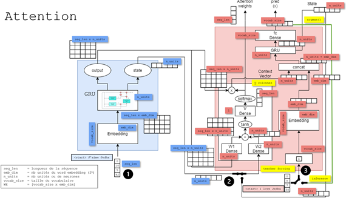

* Question : SCRAPY - What is the purpose of Scrapy projects? - **
* Réponse  : To configure the scraping process and manage settings.
The answer can be on more than one line
It can include markdown

<p align="center">
<!--  -->

</p>


$$ E = mc^2 $$


* Question : SCRAPY - How can you enable AutoThrottle in Scrapy?
* Réponse  : By uncommenting the appropriate lines in the ``settings.py`` file.

```
# settings.py

BOT_NAME = 'myproject'

SPIDER_MODULES = ['myproject.spiders']
NEWSPIDER_MODULE = 'myproject.spiders'

# Enable AutoThrottle
AUTOTHROTTLE_ENABLED = True
AUTOTHROTTLE_START_DELAY = 5
AUTOTHROTTLE_MAX_DELAY = 60
AUTOTHROTTLE_TARGET_CONCURRENCY = 1.0
AUTOTHROTTLE_DEBUG = False

# Other settings ...
```


* Question : SCRAPY - How can you rotate user agents in Scrapy? 
* Réponse  : By installing the scrapy-user-agents library and configuring the settings.py file.
